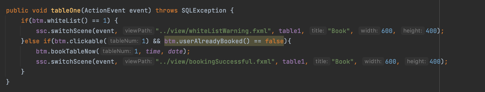
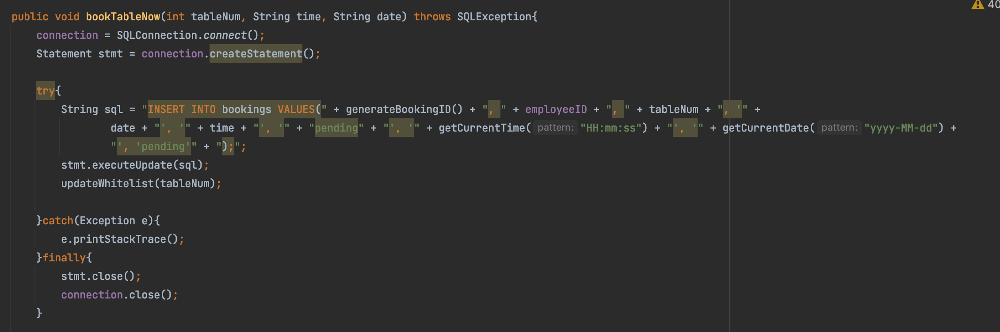
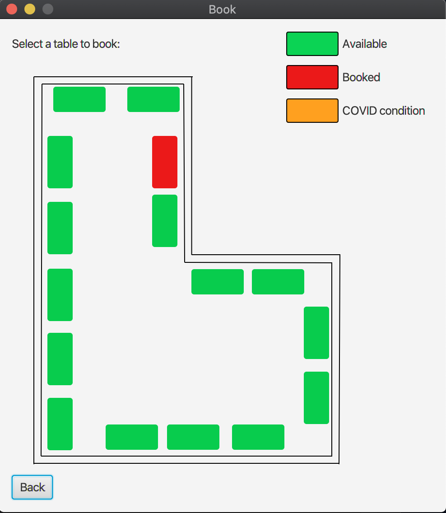

# Readme

This README should be completed by the student

# 1. About

* Author: Kai Run Leong (S3862092)

* Content : This project is a simple hotdesking graphical user interface made for the employee of Arub.

* Possible User Difficulty: 
  1) Confusion might arise when whitelist alert appears. This is because instead of redirecting the user to   the previous page, it will redirect them to the main menu.
  2) Users might not understand why multiple bookings are not allowed since there are no warning messages about the multiple bookings, therefore if the users were to attempt to make a subsequent booking the application will not have any response.
  3) Admin users might not notice that CSV reports have already been generated since a specific download location was not implemented.
  4) A minority of users might find the words difficult to read since resizing of the application was disabled.
  5) Confusion might arise if a user tries to book a date that has already been passed as no warning messages will appear. Rather, the system will not respond upon clicking the "next" button. 

# 2. Steps to be taken
* No specific steps are needed to run the application besides clicking on the run button to start the main class. The main class is an extension to the Application class in javafx. Therefore, to run a javafx application, it is important to call the start() method which initializes the first scene upon lauching in the main method.

* The only dependency which is required for this application to run as intended is the sqlite jar file. This is required so that java will be able to access the sqlite database to store important information such as employee details and booking information.

* Since there were no requirements stating that the application has to be converted into a .exe file. Upon downloading the source code, the user can immediately run the program through their console or IDE.

# 3. Execution examples
1) MVC architecture pattern was used in this coding assignment project. Therefore, depending on the controller needs, each controller should have its own model class. For example, the BookATableController.java has its own model class called BookATableModel.java. Furthermore, the model class contains all of the controller's logic since the controller is only meant to communicate between the view and model.
    
     Controller:
   
    

     Model:
    
    

     
    As shown, the controller's role is to update the view while the model is responsible for only updating data based on the user's input through the view.
     
     View (Table will be shown as booked based on the database): 
   
    

# Packaging
The main class is Main.java

Packaging for classes:
 - main.controller
 - main.model
 - main.view
Packaging for test:
 - test.model

## How to clone the project using intelliJIDEA and RUN the application
1- Download IntelliJ IDEA Ultimate Version 

2- Open IntelliJ IDEA, select "File" from the top menu, select "New" and select "Project from Version Control"  
 
3- Download the SQLite JDBC jar file.

4- In your project under project root, make a new directory called lib and move the jar file into lib folder

5- Open IntelliJ IDEA, click on "File", open "Project Structure"

6- Under "Project Setting", select "Libraries"

7- Click + button, choose Java, and navigate to your project folder, then Lib folder, choose "sqlite-jdbc-3.34.0.jar", and click on "open"

8- Also go to "Project" choose SDK 1.8 and project language level to 8

8- Click on Apply and then OK to close the window

Now you are ready to Run the Application.

Simply right click on Main.java and choose Run.
Congratulations!

Login info:

Username: test

Password: test

